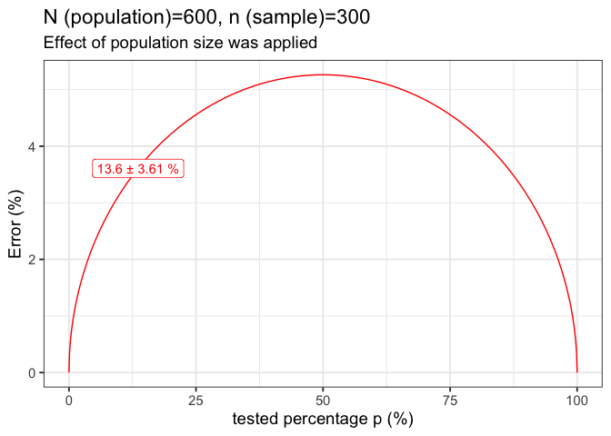

Percentage_error
================
Cédric Hubas
2022-11-25

- <a href="#introduction" id="toc-introduction">Introduction</a>
- <a href="#function" id="toc-function">Function</a>
- <a href="#graphical-representation"
  id="toc-graphical-representation">Graphical representation</a>

## Introduction

The standard error of a proportion or percentage (**p**) is its level of
precision and represents the standard deviation of that percentage. It
can be estimated using p and the sample size (**n**), as long as n is
smaller than 5% of the population size (**N**).

To obtain the margin of error, the standard error is simply multiplied
by the Zα obtained according to a confidence level (**conf** = 95, 99,
or 99.9%). Depending on the level of confidence one wishes to use, one
will look for a certain portion of the area under the centred reduced
normal distribution (0.95, 0.99, or 0.999).

For a 95% confidence level, Zα = 1,96 For a 99% confidence level, Zα =
2,58 …

The formula assumes an infinitely large population and does not depend
on the size of the population of interest. According to sampling theory,
this assumption is reasonable when the sampling fraction is **small**.
The margin of error for a particular sample is essentially the same
whether the population of interest is the size of a school, a city, a
province, or a country, as long as the sampling fraction is less than 5%
(in other words, when the population is **less than 20 times** the
sample).

In case the sampling fraction exceeds 5%, it is possible to **adjust the
margin of error** using the finite population correction factor.

## Function

The function below automatically takes this adjustment into account if
necessary.

``` r
library(ggplot2)
library(cowplot)

# Function
make_my_plot<-function(N,n,p,conf){
  per<-round(seq(0,1,0.001),3)
  typeI<-1-conf
  proba<-qnorm(1-typeI+typeI/2,mean=0,sd=1)
  threshold<-N/n
  if (threshold>20){
    err1<-proba*sqrt((per*(1-per))/n)
    my.err1<-err1[which(per==p)]*100
    data1<-data.frame(PER=per*100,ERR=err1*100)
    ggplot(data1,aes(x=PER,y=ERR))+
      ggtitle(paste("N (population)=",
                    N,
                    ", n (sample)=",
                    n,
                    sep=""),
              subtitle = "Effect of population size was considered negligible")+
      geom_line(col="red")+
      annotate(geom="label",
               x=p*100,
               y=my.err1,
               label=paste(round(p*100,2),
                           "±",
                           round(my.err1,2),
                           "%"),
               col="red",
               fill="white")+
      xlab("tested percentage p (%)")+
      ylab("Error (%)")+
      theme_bw(base_size=14)
  }else{
    err2<-proba*sqrt((per*(1-per))/n)*sqrt((N-n)/(N-1))
    my.err2<-err2[which(per==p)]*100
    data2<-data.frame(PER=per*100,ERR=err2*100)
    ggplot(data2,aes(x=PER,y=ERR))+
      ggtitle(paste("N (population)=",
                    N,
                    ", n (sample)=",
                    n,
                    sep=""),
              subtitle = "Effect of population size was applied")+
      geom_line(col="red")+
      annotate(geom="label",
               x=p*100,
               y=my.err2,
               label=paste(round(p*100,2),
                           "±",
                           round(my.err2,2),
                           "%"),
               col="red",
               fill="white")+
      xlab("tested percentage p (%)")+
      ylab("Error (%)")+
      theme_bw(base_size=14)
  }
}
```

## Graphical representation

``` r
make_my_plot(N=600,
             n=300,
             p=.136,
             conf=0.99)
```

<!-- -->
